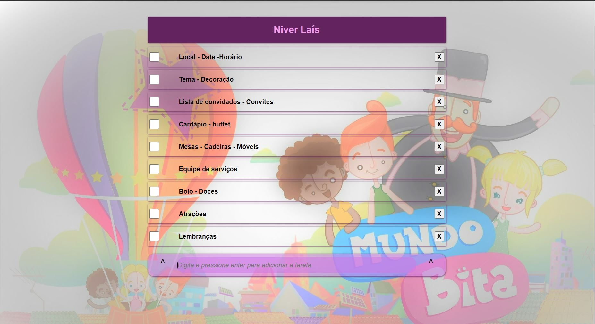

# OrganizadorEvento.Js
Organizador de eventos (JavaScript) em lista de tarefas estilo "ToDo" (CheckBox)

Um organizador de eventos estilo ToDo, com check box.

Pode ser usado pra qualquer evento, no exemplo foi usado para organizar 
um aniversário de 1 ano.
 

